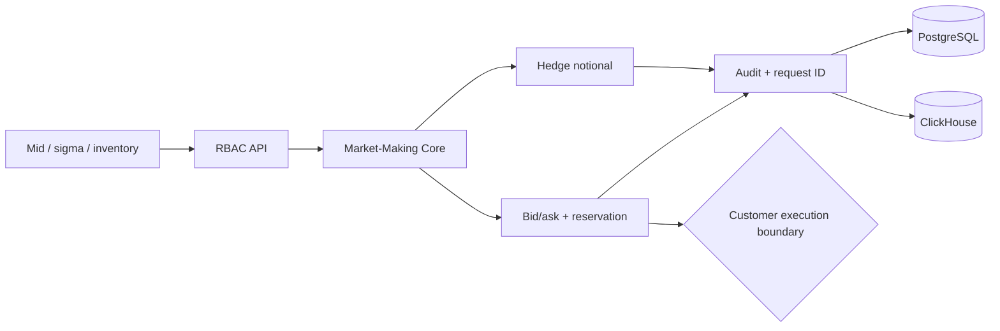

# Architecture — SYNERGY Market Maker

```mermaid
flowchart LR
A[Mid / sigma / inventory]-->B[RBAC API]
B-->C[Market-Making Core]
C-->D[Bid/ask + reservation]
C-->E[Hedge notional]
D-->F[Audit + request ID]
E-->F
F-->G[(PostgreSQL)]
F-->H[(ClickHouse)]
D-->I{Customer execution boundary}
```

Primary endpoint: `/enterprise/v1/market-maker/quote`. Quoting and hedge guidance are separated from venue execution.